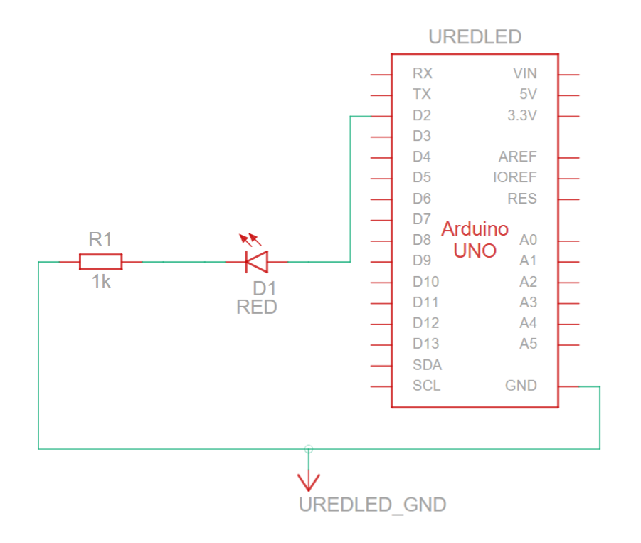
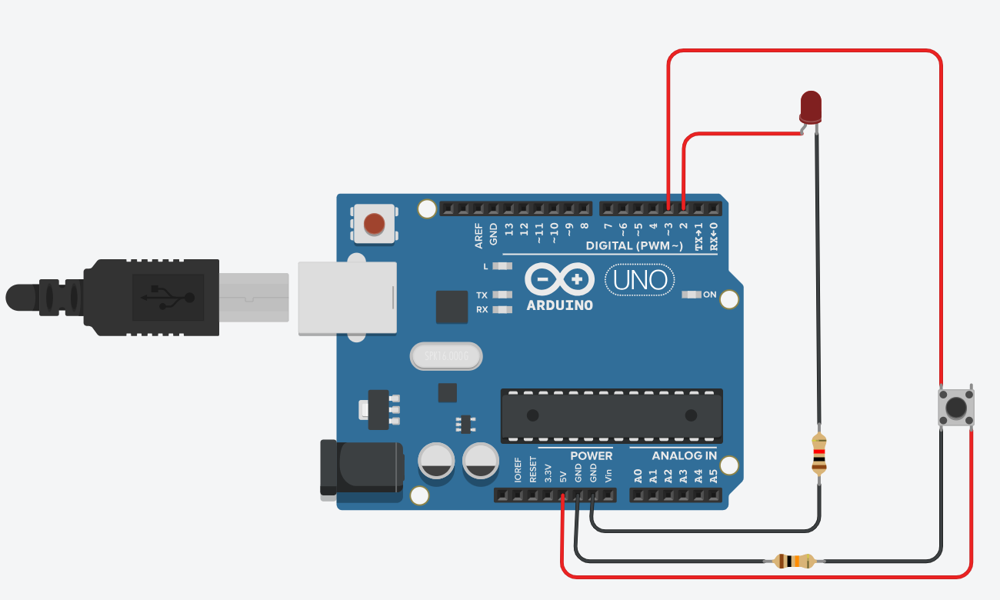

# SOS Morse Code LED - Arduino


## Description

This minimal Arduino project blinks an LED to send SOS in Morse code.
It’s designed for beginners to learn Arduino programming, LED control, and Morse timing.

## Morse Code Rules

* · (dot) = 1 unit

* – (dash) = 3 units

* Pause between symbols of the same letter = 1 unit

* Pause between letters = 3 units

* Pause between words = 7 units

* In this project, UNIT = 100 ms (modifiable to speed up or slow down the SOS).

## Components Needed

* 1 LED (any color)

* 1 resistor (220Ω – 1kΩ)

* Arduino board (Uno, Nano, etc.)

* Breadboard and jumper wires

* 1 push button

* 1 resistor (10kΩ for pull-down) 

## Wiring / Diagram

**ASCII Diagram**
```text
LED Anode (+) --------- Pin 2 (Arduino OUTPUT)
LED Cathode (-) ---/\/\/\--- GND
                  220Ω

5V ----[BUTTON]---- Pin 3 (Arduino INPUT)
                      |
                    /\/\/\
                     10kΩ
                      |
                     GND
```
## Tinkercad / Fritzing Diagram

If using Tinkercad, you can replicate the wiring:

LED:
1. LED anode (+) → Arduino Pin 2
2. LED cathode (-) → resistor (220Ω–1kΩ) → Arduino GND

Push button (pull-down configuration):
1. Button pin 1a → Arduino 5V
2. Button pin 1b → Arduino Pin 3
3. 10kΩ resistor between Pin 3 and Arduino GND

Below are the Tinkercad diagrams:




## Usage

1. Upload the code to your Arduino.
2. Press the push button to trigger the SOS Morse code sequence.
3. Release the button to stop the signal.
4. Adjust UNIT in the code to change the speed.

## Code Highlights

* dot() and dash() functions abstract Morse symbols.

* Timing respects Morse code standard.

* Easy to extend for other letters or messages.

* Button input uses an external pull-down resistor for stable readings.

## License

This project is released under the MIT License, feel free to use and modify it.
